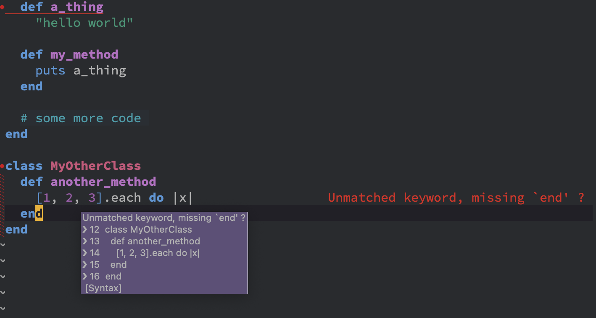
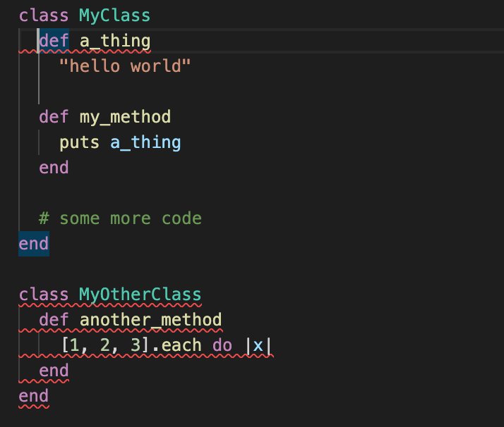
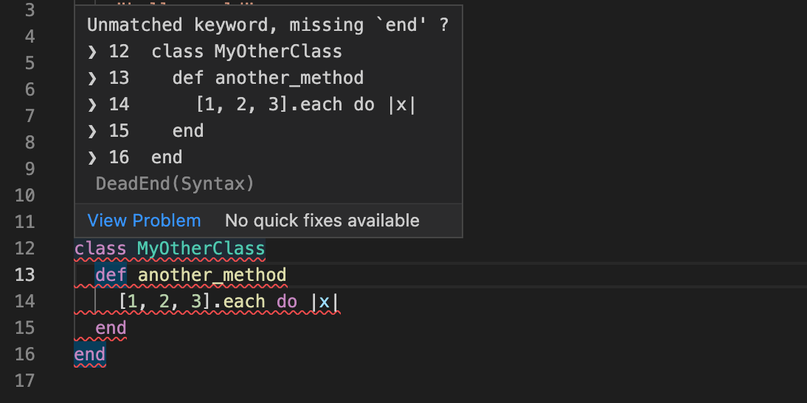

# Solargraph::DeadEnd

This gem is a plugin for the Solargraph language server, to report missing do(s) and end(s) using [DeadEnd](https://github.com/zombocom/dead_end) inside your editor!

Any editor that has a solargraph plugin can use it:

(Space)emacs with LSP mode


 

VSCode with solargraph plugin




The highlighted lines should give you a good clue about where the problem lies. If you hover over the error you'll get even more info:



## Installation
1. [Install solargraph](https://github.com/castwide/solargraph#installation) if you don't have it already.
2. Add this gem:

`gem install solargraph-dead_end`

(or include it in your gemfile if you're using solargraph in bundle mode)

3. Configure your .solargraph.yml:

```
reporters:
- dead_end
...
plugins:
- solargraph-dead_end
```
